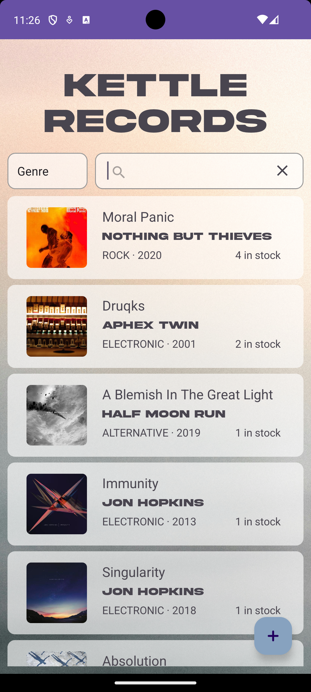
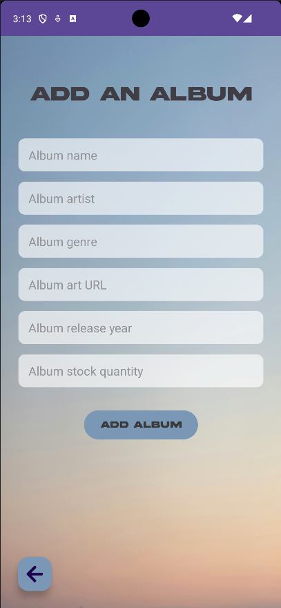
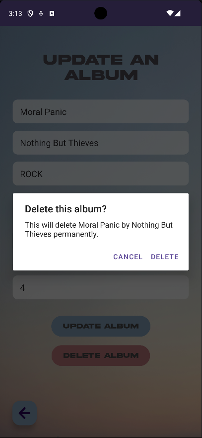

## The Brief
The Kettle Record Store has a [robust new API](https://github.com/s-kettle/record-shop-api), and they now
need a new Android mobile front-end to show it off! The app should
display all albums by default, and allow for filtering, adding, deleting
and updating of albums. All must be presented in a modern, polished layout.

## Learnings
- Android Studio
- RecyclerView
- Two-way data binding
- Custom activities with click handling
- .xml layout creation
- MVVM architecture
- Retrofit
- Interacting with an external API
- Spinner as dropdown menu
- Data filtering

## Screenshots

### Main display with RecyclerView

### Add new album

### Update / delete album

### Deletion warning

### Filtering

# Future considerations
- [ ] Filter using query parameters to API
- [ ] User roles / login (only admin can add, delete, etc.)
- 

